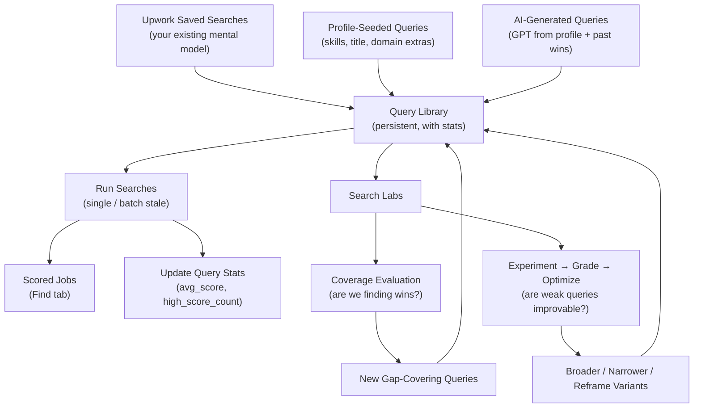
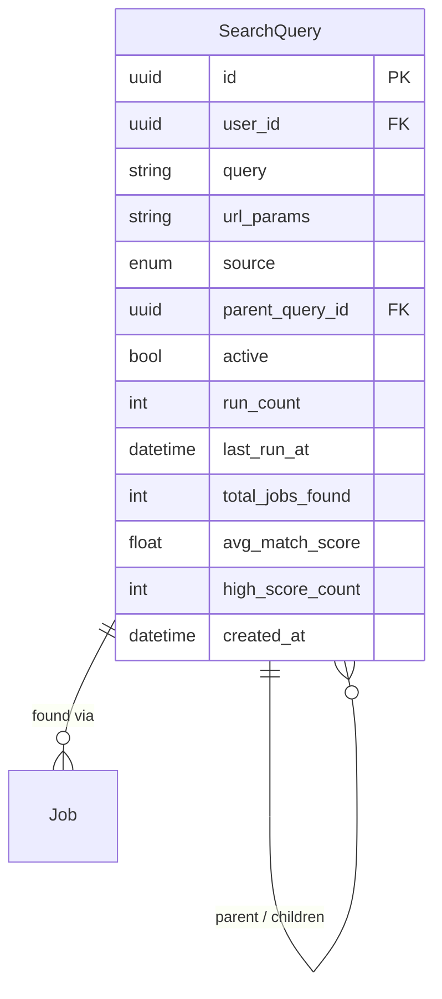
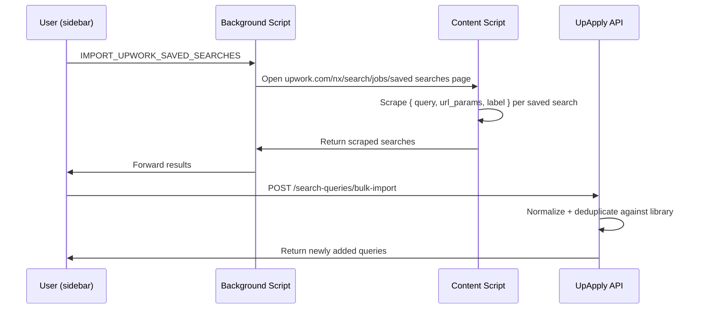
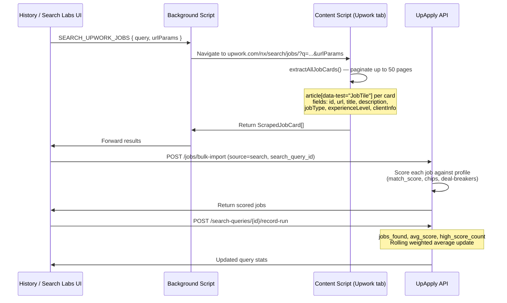
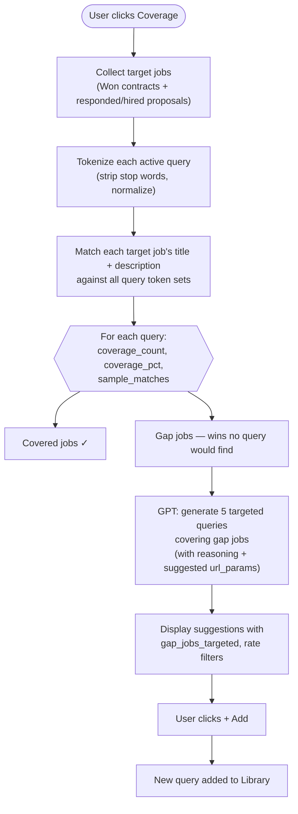
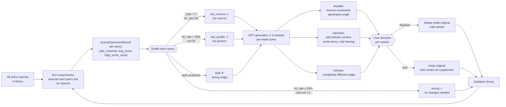
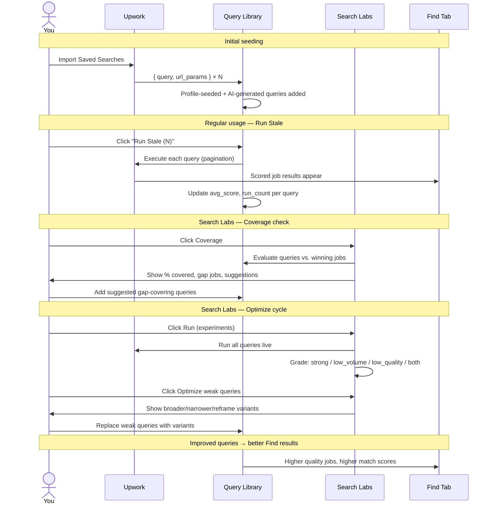
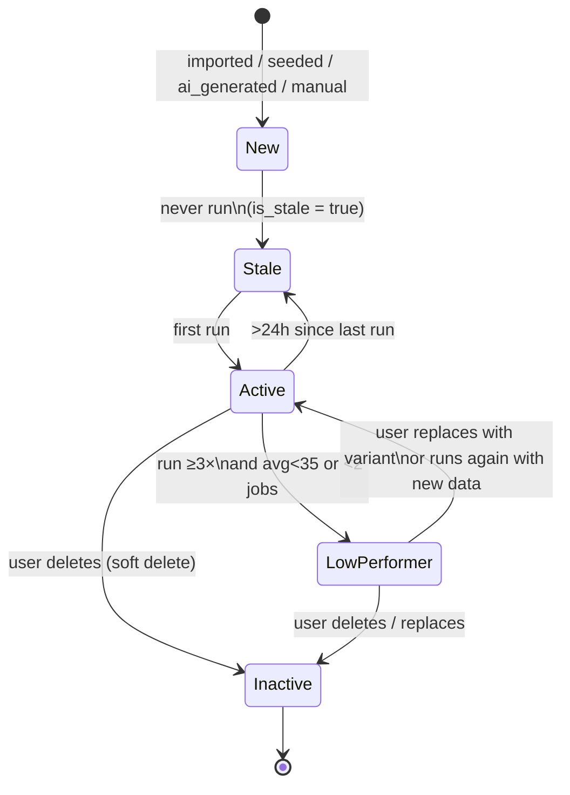

# Search & Search Labs — Architecture and Workflow

**Project:** UpApply
**Date:** 2026-03-17
**Scope:** Query Library, search execution pipeline, and the Search Labs feedback loop

---

## Overview

The search system treats job discovery as a **learnable, optimizable process** — not a one-off search box. You maintain a persistent **Query Library** of saved searches, each accumulating performance statistics across runs. **Search Labs** is the feedback loop that continuously improves them: measuring coverage against your wins, grading live results, and using AI to suggest and optimize queries that aren't performing.

Your Upwork saved searches are the explicit starting point — the user's existing mental model of how clients look for people like them — and the system's job is to empirically test and iteratively improve on that baseline.

---

## System Layers

---

## Layer 1 — The Query Library

Every search is stored as a `SearchQuery` row with cumulative stats updated on each run.

### Data Model

### Computed Properties (not stored, derived at read time)

| Property | Formula | Purpose |
|---|---|---|
| `performance_score` | `avg_match_score × (high_score_count / total_jobs_found) × min(1, total_jobs_found / 10)` | Composite quality + volume metric. Saturates at 10 jobs. |
| `is_stale` | never run **or** `last_run_at` > 24h ago | Drives the "Run Stale" batch button |
| `is_low_performer` | run ≥ 3× **and** (avg < 35 **or** total < 2 jobs) | Highlighted yellow in UI; candidates for replacement |

### Query Sources

| Source | How Created |
|---|---|
| `imported` | Scraped from your Upwork saved searches page |
| `seeded` | Rule-generated from profile: each skill, skill pairs, title, domain extras |
| `ai_generated` | GPT-suggested based on top performers + past winning jobs |
| `manual` | Typed by you directly in the Query Library |

---

## Layer 2 — Seeding From Upwork Saved Searches

Your Upwork saved searches represent the search strategies you've already deliberately designed. They're imported as-is — same keywords, same filters — and become the **baseline the Lab will measure and improve**.

**Default URL parameters** applied to all searches: `contractor_tier=2,3&proposals=0-4`
(intermediate/expert tier; low-competition jobs with few proposals)

---

## Layer 3 — Search Execution Pipeline

Every query runs through the same pipeline whether triggered manually, in bulk, or by the Search Lab experiments.

**Scored jobs surface in the Find tab**, filterable by score threshold (≥90 / ≥70 / ≥50) and skill chips, sortable by score, recency, or your star rating.

---

## Layer 4 — Search Labs: Coverage Evaluation

*"Are my queries finding the jobs I know I should be targeting?"*

Coverage evaluation uses your **proven wins** as ground truth — jobs from Won Contracts imports and proposals that got a response or hire — and tests whether your current query set would have *found* those jobs.

**Coverage result includes:**
- Overall coverage % with a visual bar
- Per-query breakdown (how many wins each query covers)
- Up to 5 uncovered win titles
- 5 AI-suggested queries with reasoning and the specific gap jobs they'd target

---

## Layer 5 — Search Labs: Experiment → Grade → Optimize Loop

*"Of the queries I'm running, which ones are working? What should replace the weak ones?"*

### Grade Definitions

| Grade | Condition | Strategy |
|---|---|---|
| **strong** | hit_rate ≥ 30% and jobs_returned ≥ 5 | Keep as-is |
| **low_volume** | jobs_returned < 5 | Make **broader** — fewer required words, more general framing |
| **low_quality** | high_score_count / jobs_returned < 30% | Make **narrower** — add domain context, specificity |
| **both** | low volume AND low quality | **Reframe** — completely different search angle |

---

## Complete End-to-End Flow

---

## Query Lifecycle

---

## Key Design Decisions

**Why your Upwork saved searches are the starting point:**
They represent deliberate choices about how you believe clients search for your skills. Rather than discarding them and starting fresh, the system treats them as hypotheses to be tested empirically. If they perform well, great. If they don't, the Lab tells you why and suggests improvements.

**Why the system biases toward inclusivity (broader over narrower):**
The cost of missing a good job is higher than the cost of seeing an irrelevant one. Low-volume queries are penalized harder. The optimization prompt explicitly instructs GPT to favor finding more good jobs over perfect precision.

**Why performance_score saturates at 10 jobs:**
A query returning 3 jobs all at 90 score is more useful than one returning 100 jobs at average 40. The formula rewards quality-per-job, not raw volume, while still requiring minimum volume before trusting the quality signal.

**Why parent_query_id exists:**
Variants created via optimization are linked back to the original weak query. This enables future analytics on which optimization strategies actually produced better results over time.

---

## Current Status

| Component | Status |
|---|---|
| Query Library (CRUD, stats, seed, generate) | ✅ Production |
| Bulk import from Upwork saved searches | ✅ Production |
| Single query run + stat recording | ✅ Production |
| Run all stale batch | ✅ Production |
| Search Labs: Coverage evaluation | ✅ Production |
| Search Labs: Experiment + Grade + Optimize | ✅ Production |
| Find tab with score/chip/rating filters | ✅ Production |
| Saved Jobs page badge scorer (notifications pattern) | 🔜 Planned (see plan file) |
